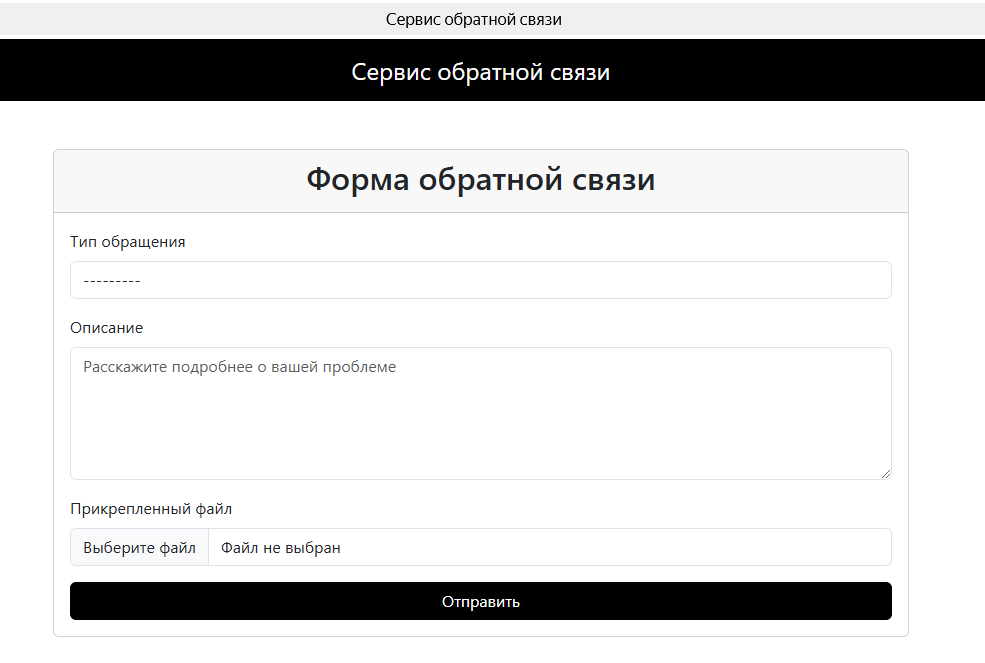

# Сервис обратной связи

Проект представляет собой веб-приложение для сбора обратной связи от пользователей.

## Функциональность

- Выбор типа обращения (пожелание, проблема, претензия, другое)
- Текстовое описание обращения
- Возможность прикрепить файл
- Валидация данных формы
- Ограничение размера загружаемых файлов (10MB)

## Скриншоты

### Главная страница


### Страница успешной отправки


## Установка и запуск

1. Клонируйте репозиторий:
```bash
git clone <repository-url>
cd serverfeedback
```

2. Создайте виртуальное окружение и активируйте его:
```bash
python -m venv venv
source venv/bin/activate  # для Linux/Mac
venv\Scripts\activate     # для Windows
```

3. Установите зависимости:
```bash
pip install -r requirements.txt
```

4. Примените миграции:
```bash
python manage.py migrate
```

5. Создайте суперпользователя:
```bash
python manage.py createsuperuser
```

6. Запустите сервер:
```bash
python manage.py runserver
```

## Структура проекта

- `feedback/models.py` - модель данных для хранения обращений
- `feedback/forms.py` - форма для создания обращений
- `feedback/views.py` - представления для обработки запросов
- `feedback/templates/` - шаблоны страниц

## API Endpoints

- `GET /` - страница с формой обратной связи
- `POST /` - endpoint для отправки формы
- `GET /success/` - страница успешной отправки

## Модель данных

### Feedback
- `feedback_type` (CharField) - тип обращения
- `description` (TextField) - описание обращения
- `attachment` (FileField) - прикрепленный файл (опционально)
- `created_at` (DateTimeField) - дата создания 